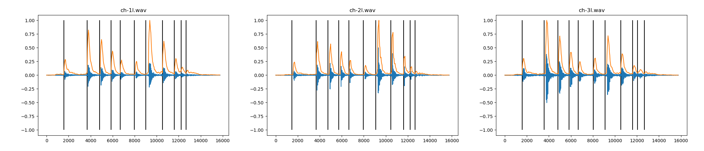

# Hypersurfaces Software Development Challenge

# Follow the instructions below to get started

1. Use the given docker-compose file to start the project with the existing services: flask, nginx and database.
2. Complete the below tasks.
3. Add as many unit tests as you deem necessary. 
4. Feel free to add modules to requirements.txt or change the project structure. 
5. Add any libraries or testing frameworks you think are necessary.

# Tasks

1. Create a new webpage and plot the waveform of the audio files inside this repo, there are three audio files:
```
ch-1l.wav
ch-2l.wav
ch-3l.wav
```
2. The values from the `data.json` file should be added to the Database.
3. Use the data you added to the Database to display the peaks for each file as lines on top of the audio plots. Your plot should look similar to the image below:

4. Write a few critical unit tests to ensure core functions are being covered.

# Submission

 * Create a private repository (github, gitlab, bitbucket etc) with the code and send us the link to this.
 * Explain to us how to run your code in the README or in a file inside the project. 
 * Explain if there are any integrations or additional tools we should need.

# Notes

 * A lot of these tasks contain audio processing (because that's what we do!) If you haven't worked much with audio librosa is a good python library to get started. It should cover most of the things we'd want to do.
 * For frontend and visual displays we use React and BokehJS, feel free to use these tools or any others you find fit
 * We don't expect a complete solution or complete test coverage but a few critical unit tests are part of any good project
 * If you're stuck on specific areas, explain to us how you would have solved the issue and the steps. We're more interested in your problem-solving approach.
