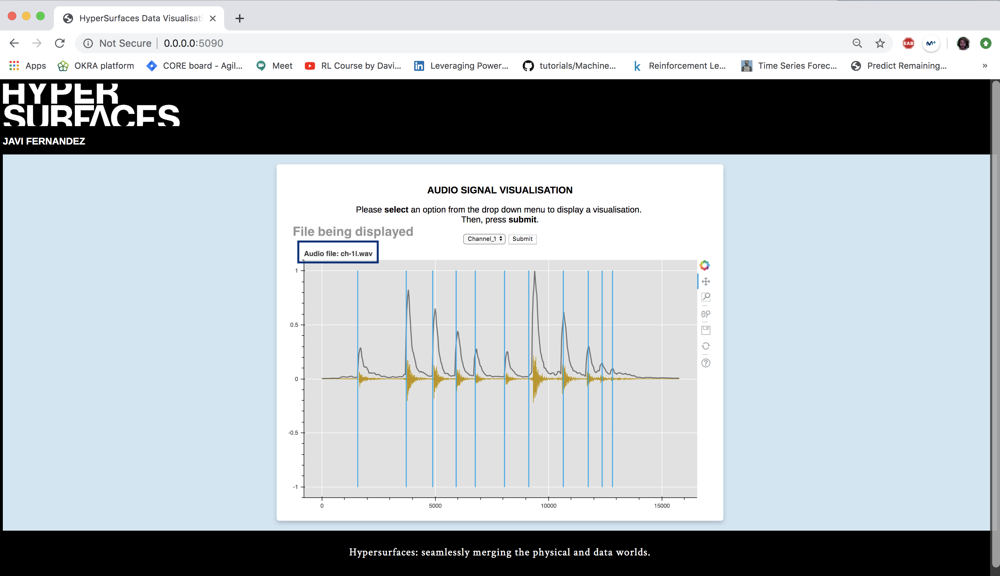
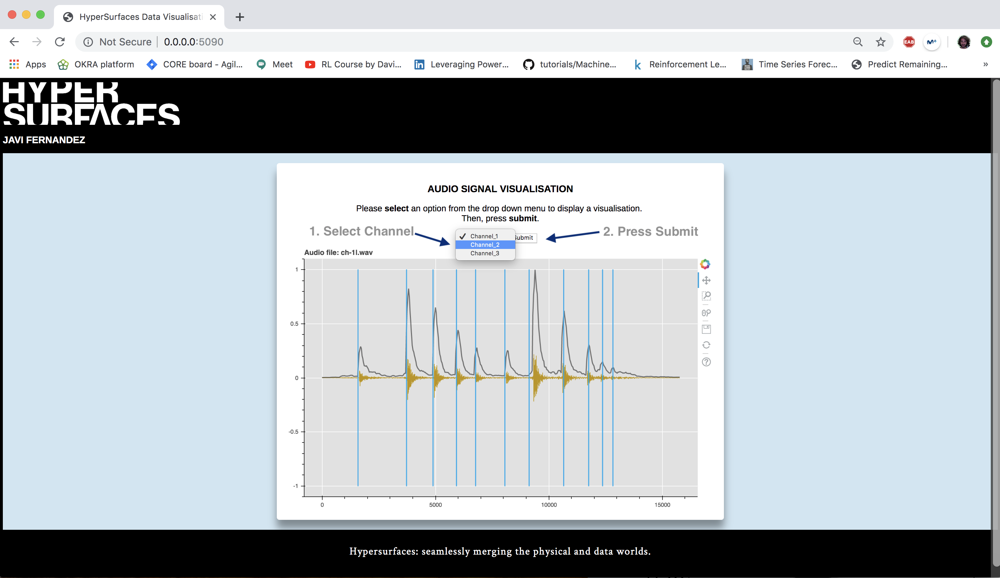
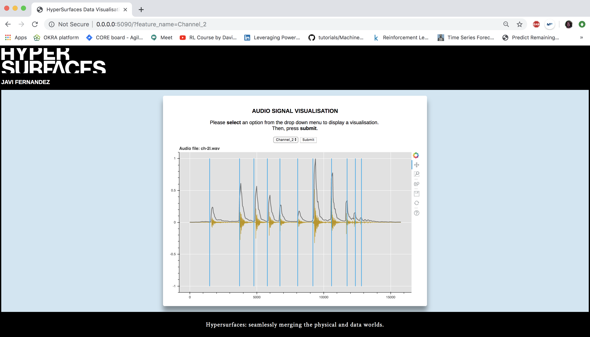
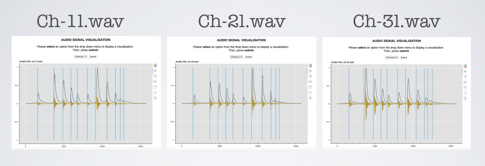

# Software Development
Repository to work on a Software Development project to process audio signals.

## How to run

1. Modify file permissions with chmod: add the following in *./Dockerfile*.
```
RUN chmod 644 app.py
```
2. Specify shebang line in the first line of executable *./app.py* to locate the right interpreter.
```
#! /usr/local/bin/python3
```
3. Build up the Docker services. 
>> Execute on terminal the next command (after cd to working directory)
```
docker-compose build
```
4. Build up the docker containers in the local directory. 
>> Execute on terminal the next command (after cd to working directory)
```
docker-compose -f docker-compose.yml up 
```

## Structure

**./app.py**	This is the main file that is invoked to start up the development server. 

**./requirements.txt**	This file lists all of the Python packages that your app depends on. 

**./aux.py** This file contains a series of auxiliary functions needed to run and execute app.py

**./ch-1l.wav, ./ch-2l.wav, ./ch-3l.wav** Audio files that are going to be displayed.

**./data.json** json file containing values to be displayed on top of ch-#l.wav audio files.

**./database.py** Database in which json values are loaded before being plotted.

*NOTE: In this example databases are not used and json values are loaded and processed into pandas DataFrames.*

**./docker-compose.yml** Docker compose file defining services, networks and volumes.

**./env_file** Set environment variables in the docker container.

**./templates/index.html** html file containing css style configurations to design the final website using the figs passed from app.py


# Output
The output will be directed on your browser at: 
http://0.0.0.0:5090/

A drop down menu allows the user to select one of the three .wav audio signals that are available.
```
Channel_1 :: ch-1l.wav

Channel_2 :: ch-2l.wav

Channel_3 :: ch-3l.wav
```
By default Channel_1 is displayed. 



By simply selecting from the drop down list and submitting any other Channel the new figure will be generated and displayed for the desired audio signal.

See how to display Channel 2 (*ch-2l.wav*)





Each figure displays the audio signal (dark golden yellow), lines on top of the audio signal (dark grey), and peaks' positions as vertical lines (sky blue).



On the right pannel different options are available thanks to the Bokeh config. such as zoom in/out, scrolling, saving the figure as a .png file. 

